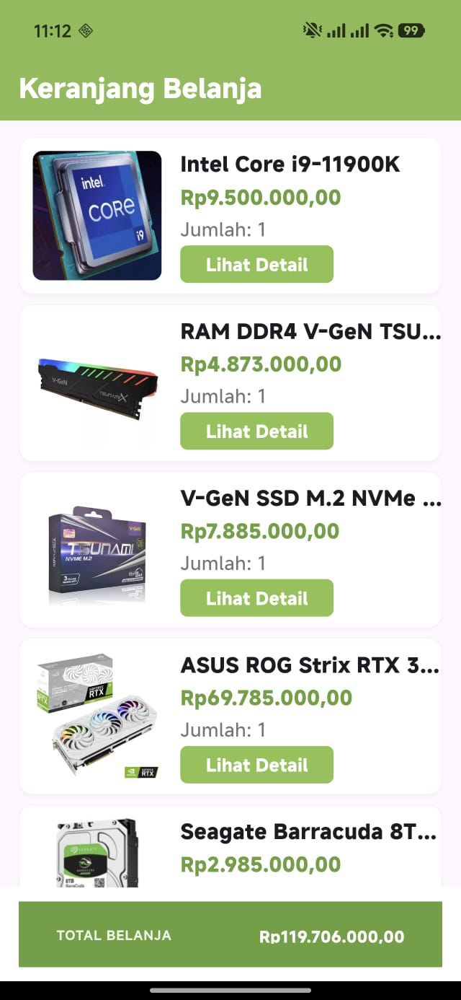
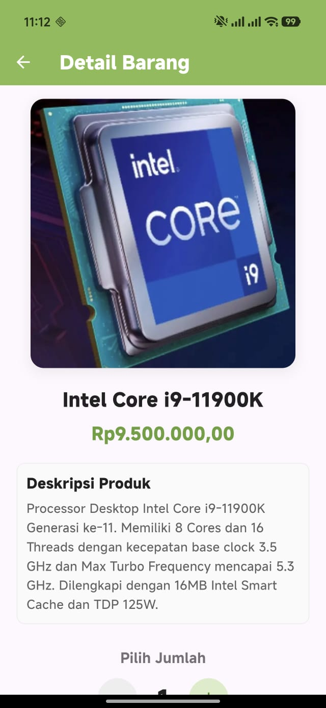

# 🛒 Tugas Navigation - Pemrograman Berbasis Mobile

Aplikasi ini merupakan **kelanjutan dari tugas [tugas_widget_pemrograman_berbasis_mobile](https://github.com/riyansetiyadi/tugas_widget_pemrograman_berbasis_mobile)**. Aplikasi ini dirancang untuk menunjukkan implementasi interaksi state, pengelolaan kuantitas barang secara dinamis, navigasi antar halaman, dan pemformatan mata uang Rupiah pada aplikasi berbasis Flutter.

---

## 📋 Deskripsi Aplikasi

Aplikasi **E-Commerce Cart** menyajikan daftar produk perangkat keras/komponen komputer di dalam keranjang belanja. Pengguna dapat melihat detail produk, menyesuaikan jumlah barang yang ingin dibeli, dan melihat perubahan total harga secara otomatis dan *real-time* di halaman utama.

---

## 📸 Screenshot

| Halaman Utama | Halaman Detail |
|:---:|:---:|
|  |  |

---


## 🚀 Fitur Utama

1. **Daftar Keranjang Belanja (`HomeScreen`)**:
   - Menampilkan list barang belanjaan menggunakan kombinasi widget `ListView`, `Card`, `Row`, dan `Column`.
   - Menampilkan gambar produk, nama produk, harga barang, dan kuantitas saat ini.
   - Dilengkapi tombol **"Lihat Detail"** untuk masuk ke halaman detail masing-masing barang.

2. **Kalkulasi Total Belanja Otomatis**:
   - Bagian bawah halaman utama menampilkan total biaya dari seluruh barang yang ada di keranjang.
   - Total harga dihitung secara dinamis: `Total = Jumlah (Barang A * Harga A) + (Barang B * Harga B) + ...`.

3. **Format Mata Uang Rupiah (IDR)**:
   - Menggunakan package `intl` dengan format `NumberFormat.simpleCurrency(locale: "id_ID")` untuk konversi angka harga ke format rupiah yang rapi (misal: `Rp9.500.000,00`).

4. **Kounter Interaktif (`DetailScreen`)**:
   - Halaman detail menampilkan gambar produk berukuran besar (350x350) dengan sudut tumpul (`ClipRRect`).
   - Fitur penambah (`+`) dan pengurang (`-`) jumlah barang yang responsif dengan validasi batas minimal (`0`).

5. **Navigasi Dua Arah & Pengembalian Data (State Sync)**:
   - Navigasi menggunakan *Named Routes* (`/home` dan `/detail`) dengan pengiriman argumen objek `ModelKeranjang`.
   - Menggunakan `Navigator.pop(context, {'jumlahBarang': jumlahBarang})` untuk mengirimkan kembali kuantitas baru ke halaman utama sehingga total belanjaan langsung diperbarui.

---

## 🛠️ Konsep & Widget yang Digunakan

| Kategori | Widget / Konsep | Deskripsi / Fungsi |
| :--- | :--- | :--- |
| **State Management** | `StatefulWidget` & `setState` | Memperbarui UI secara dinamis saat kuantitas barang atau total belanja berubah. |
| **Navigasi & Routing** | Named Routes & `Navigator` | Mengelola perpindahan halaman `/home` dan `/detail` serta mengirim balik nilai kuantitas. |
| **Tata Letak (Layout)** | `Scaffold`, `AppBar`, `BottomAppBar`, `Row`, `Column`, `Container`, `SizedBox` | Menyusun struktur dasar halaman secara horizontal dan vertikal. |
| **Komponen Visual** | `Card`, `ClipRRect`, `Image` (AssetImage), `Text`, `Icon`, `ElevatedButton`, `IconButton` | Membuat kartu produk, membulatkan sudut gambar, menampilkan ikon `add`/`remove`, dan tombol interaksi. |
| **Utilitas** | Package `intl` (`NumberFormat`) | Memformat angka harga produk menjadi format Rupiah Indonesia (`id_ID`). |

---

## 📁 Struktur Folder Proyek

```text
tugas_navigation_pemrograman_berbasis_mobile/
├── android/            # Konfigurasi platform Android
├── ios/                # Konfigurasi platform iOS
├── images/             # Aset gambar produk komputer lokal
├── screenshots/        # Screenshot tampilan aplikasi
├── lib/
│   ├── models/
│   │   └── model_keranjang.dart   # Model representasi data barang keranjang
│   ├── detail_barang.dart         # Halaman detail produk & kuantitas counter
│   ├── home_screen.dart           # Halaman utama daftar belanja & kalkulasi total
│   └── main.dart                  # Entry point aplikasi & konfigurasi routing
├── pubspec.yaml        # Dependensi proyek (termasuk package `intl` & aset gambar)
└── README.md           # Dokumentasi proyek (File Ini)
```

---

## 🔗 Link Download & Demo Aplikasi

| Platform | Tautan / Download | Keterangan |
| :--- | :--- | :--- |
| **🤖 Android** | [](https://github.com/riyansetiyadi/tugas_navigation_pemrograman_berbasis_mobile/releases/download/v1.0.0/app-release.apk) | Unduh file `.apk` untuk diinstal langsung di perangkat Android. |
| **🌐 Web Demo** | [](https://riyansetiyadi.github.io/tugas_navigation_pemrograman_berbasis_mobile/) | Coba aplikasi langsung di browser Anda secara online. |
| **🪟 Windows** | [](https://github.com/riyansetiyadi/tugas_navigation_pemrograman_berbasis_mobile/releases/download/v1.0.0/windows-release.zip) | Unduh paket aplikasi `.zip` untuk dijalankan di PC/Laptop Windows. |